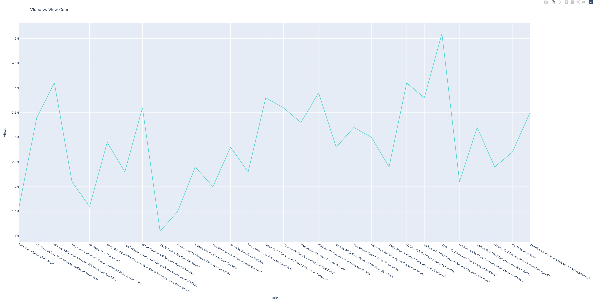

# Views Bot

## Description
This Bot is used to extract the view count by video title, given the link to the youtuber's videos. Mkbhd [example](https://www.youtube.com/c/mkbhd/videos)

[//]: # (![img.png]&#40;imgs/mkbhdVideos.png&#41; - Commented out Example)

  

And to plot the view count by video using Plotly

  

## Setup

### Modules

[`selenium`](https://www.selenium.dev/) - Allows for python to interface with FireFox

[`beautifulSoup4`](https://www.crummy.com/software/BeautifulSoup/) - Used for structuring the data scraped from the web
page

`pandas` - Data Science and Data Analysis module

[`plotly`](https://plotly.com/python/) - Graphing module for Python

Either will need to npm install these modules or if using Pycharms `File -> Settings -> Project -> Project Interpreter`
to add the module

### WebDriver

This program uses the MS Edge Driver which can be on the [Edge Driver](https://developer.microsoft.com/en-us/microsoft-edge/tools/webdriver/) Page


1. For Windows, download the Edge driver that matches your Edge version zip file
2. Extract the folder into a location of your choosing
3. Add folder to Path and restart your system or modifiy this line:
    - ``edgeDriver = Service('Drivers\\edgedriver_win64\\msedgedriver.exe')``
    - **Currently**, this repo contains the driver, though it will be outdated as Edge is updated

## Sources
[Module and Driver Installation Guide](https://www.geeksforgeeks.org/how-to-install-selenium-in-python/)

## Steps
1. Download the necessary modules
2. Create an Edge objects to access urls
3. Create a `BeautifulSoup` object to obtain html tags
   - ```python
     self.soup = BeautifulSoup(self.edge.page_source, features="html.parser")
     ```
4. Using `BeautifulSoup`, extract all youtube videos
   - ```python
     videos = self.soup.find_all("ytd-grid-video-renderer", {"class": "style-scope ytd-grid-renderer"})
     ```
    
5. For each video, extract the Title and View Count using `.find()` function by providing the tag type and the associated class or id
    - ```python
      videoTitle = video.find("a", {"id": "video-title"}).text
      ```
6. Tabularize the data using pandas
    - ```python
        pd.set_option('display.max_rows', 100)
        self.df = pd.DataFrame.from_records(videosProcessed, columns=["Title", "Views", "Views Formatted"])
      ```
7. Plot out the views per video using plotly
    - ```python
      import plotly.express as px
      titles = self.df.loc[:, "Title"]
      views = self.df.loc[:, "Views"]
      fig = px.line(x=titles,
                     y=views,
                     title='Video vs View Count',
                     color_discrete_sequence =['mediumturquoise']*len(self.df),
                     labels=dict(x="Title", y="Views"))

      fig.show()
      ```